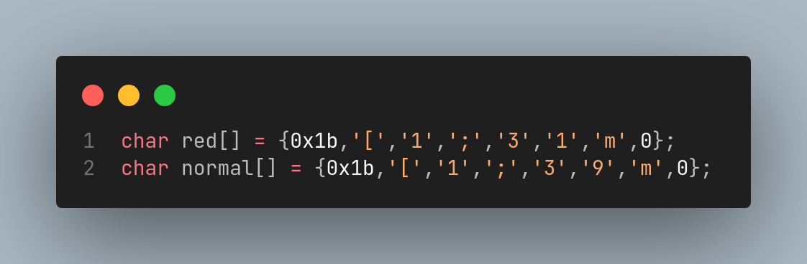
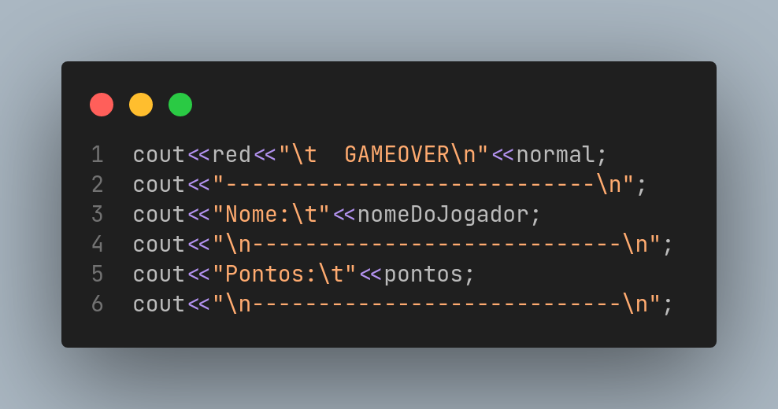

<div align="center">
    
</div>

<div align="center">
    <a href="#Cores">
        
    </a>

</div>

<h2 align="center"><span style="color: purple">Cores </span>para C++</h2>

<br><hr>
<p align="center">
   <a href="#-como-usar-as-cores">Como usar as cores</a> ⚬
   <a href="#Cores">Cores</a>
</p><hr><br>

## Como usar as cores
<div align="center">
    
    
</div>
<br>

## Cores
<h5>Blue color<span style="color: blue"> [x]:</span></h5>

```cpp
char blue[] = {0x1b,'[','1',';','3','4','m',0};
```

<h5>Green color<span style="color: green"> [x]:</span></h5>

```cpp
char green[] = {0x1b,'[','1',';','3','2','m',0};
```

<h5>Yellow color<span style="color: yellow"> [x]:</span></h5>

```cpp
char yellow[] = {0x1b,'[','1',';','3','3','m',0};
```

<h5>Pink color<span style="color: pink"> [x]:</span></h5>

```cpp
char pink[] = {0x1b,'[','1',';','3','5','m',0};
```

<h5>Gray color<span style="color: gray"> [x]:</span></h5>

```cpp
char gray[] = {0x1b,'[','1',';','3','0','m',0};
```

<h5>Red color<span style="color: red"> [x]:</span></h5>

```cpp
char red[] = {0x1b,'[','1',';','3','1','m',0};
```

<h5>Normal color [x]:</h5>

```cpp
char normal[] = {0x1b,'[','1',';','3','9','m',0};
```

<br><br><br>


<a target="_blank" href="https://icons8.com/icon/kQfe7y1bp4fu/colors">License by Icons8</a>
